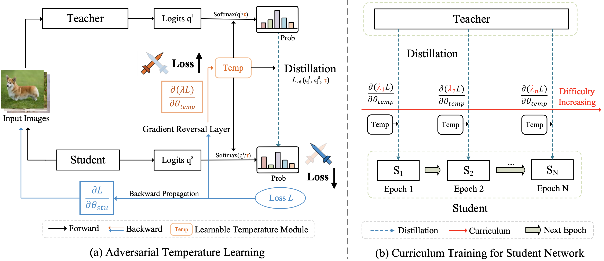
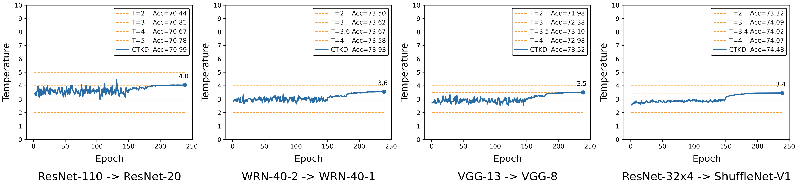

# CTKD

This repo is the official pytorch implementation for "Curriculum Temperature for Knowledge Distillation" (AAAI 2023) https://arxiv.org/abs/2211.16231

Detailed chinese interpretation is available on a chinese forum ZhiHu: https://zhuanlan.zhihu.com/p/595735843.

### Abstract

CTKD organizes the distillation task from easy to hard through a dynamic and learnable temperature. 
The temperature is learned during the student’s training process with a reversed gradient that aims to maximize the distillation loss (i.e., increase the learning difficulty) between teacher and student in an adversarial manner.

As an easy-to-use plug-in technique, CTKD can be seamlessly integrated
into existing state-of-the-art knowledge distillation frameworks and brings general improvements at a negligible additional computation cost.

### Framework 

<div style="text-align:center"></div>

(a) We introduce a learnable temperature module that predicts a suitable temperature τ for distillation. The gradient reversal layer is proposed to reverse the gradient of the temperature module during the backpropagation. 

(b) Following the easy-to-hard curriculum, we gradually increase the parameter λ, leading to increased learning difficulty w.r.t. temperature for the student.

### Visualization

The learning curves of temperature during training:

<div style="text-align:center"></div>


### Main Results

On CIFAR-100:

| Teacher <br> Student |RN-56 <br> RN-20|RN-110 <br> RN-32| RN-110 <br> RN-20| WRN-40-2 <br> WRN-16-2| WRN-40-2 <br> WRN-40-1 | VGG-13 <br> VGG-8|
|:---------------:|:-----------------:|:-----------------:|:-----------------:|:------------------:|:------------------:|:--------------------:|
| KD | 70.66 | 73.08 | 70.66 | 74.92 | 73.54 | 72.98 |
| +CTKD | 71.19 | 73.52 | 70.99 | 75.45 | 73.93 | 73.52 |
| +CTKD**+Ours** | **71.19** | **73.52** | **70.99** | **75.45** | **73.93** | **73.52** |

On ImageNet-2012:

|                 | Teacher <br> (RN-34) | Student <br> (RN-18) | KD | +CTKD 
|:---------------:|:---------------:|:-----------------:|:-----------------:|:-----------------:|
| Top-1           | 73.96   | 70.26 | 70.83 | 71.32 |
| Top-5           | 91.58   | 89.50 | 90.31 | 90.27 |

## Requirements 

- Python 3.8
- Pytorch 1.11.0
- Torchvision 0.12.0

## Running

1. Download the pretrained teacher models and put them to `./save/models`.

|  Dataset | Download |
|:---------------:|:-----------------:|
| CIFAR teacher models   | [[Baidu Yun]](https://pan.baidu.com/s/1ncvsfLTQ-GdXtKY-xtaweg?pwd=meaf)   |
| ImageNet teacher models  | [[Baidu Yun]](https://pan.baidu.com/s/1408PoziVAA8E3DojxUq1Hw?pwd=s4ma)   |

If you want to train your teacher model, please consider using `./scripts/run_cifar_vanilla.sh` or `./scripts/run_imagenet_vanilla.sh`.

After the training process, put your teacher model to `./save/models`.

2. Training on CIFAR-100:
- Download the dataset and change the path in `./dataset/cifar100.py line 27` to your current dataset path.
- Modify the script `scripts/run_cifar_distill.sh` according to your needs.
- Run the script.
    ```  bash
    sh scripts/run_cifar_distill.sh  
    ```

3. Training on ImageNet-2012:
- Download the dataset and change the path in `./dataset/imagenet.py line 21` to your current dataset path.
- Modify the script `scripts/run_imagenet_distill.sh` according to your needs.
- Run the script.
    ```  bash
    sh scripts/run_imagenet_distill.sh  
    ```

## Model Zoo
We provide complete training configs, logs, and models for your reference.

CIFAR-100:

- Combing CTKD with existing KD methods, including vanilla KD, PKT, SP, VID, CRD, SRRL, and DKD.  
(Teacher: RN-56, Student: RN-20)  
[[Baidu Yun]](https://pan.baidu.com/s/13-z-T4ooQDlWrm4isEH4qA?pwd=3bmy) [[Google]](https://drive.google.com/drive/folders/1pT8zmmOFMs5MqDLP6b4Cobv422CAcVF4?usp=sharing)

ImageNet-2012:
- Combing CTKD with vanilla KD:  
[Baidu Yun] [Google]


## Citation

If this repo is helpful for your research, please consider citing our paper:

```
@article{li2022curriculum,
  title={Curriculum Temperature for Knowledge Distillation},
  author={Li, Zheng and Li, Xiang and Yang, Lingfeng and Zhao, Borui and Song, Renjie and Luo, Lei and Li, Jun and Yang, Jian},
  journal={arXiv preprint arXiv:2211.16231},
  year={2022}
}
```

For any questions, please contact me via email (zhengli97@mail.nankai.edu.cn).
